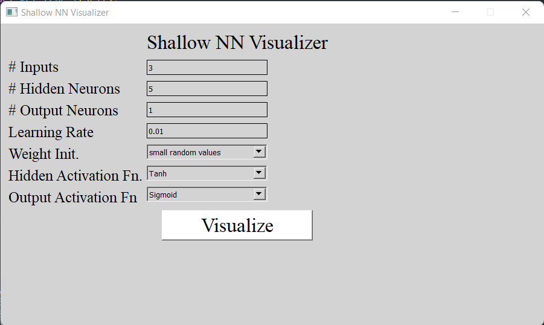
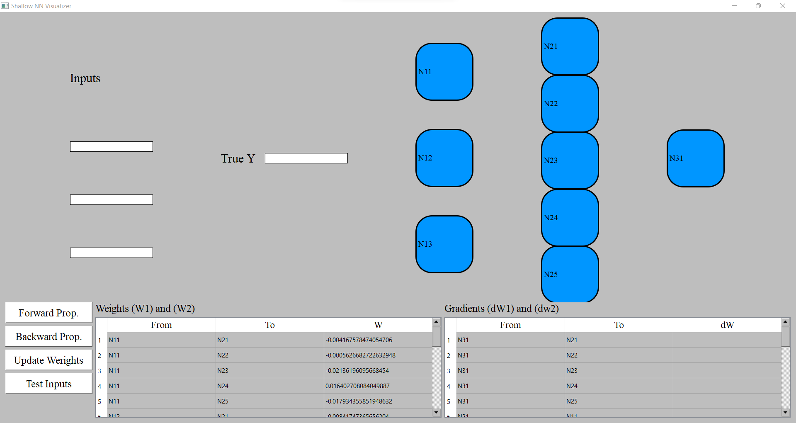
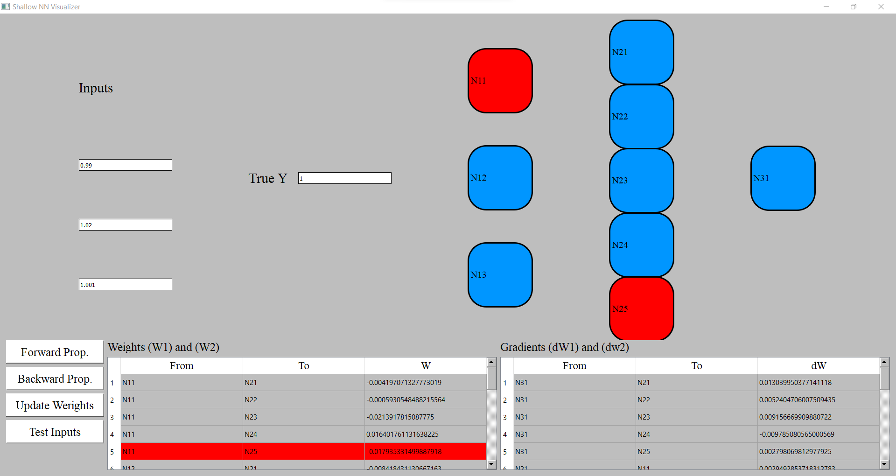

# Back-Propagation Visualizer

## Description

This project is aiming to visualize backpropagation in shallow neural networks, and to show which neurons fire at testing time.
There are two main windows, the first window is shown below, it is responsible for collecting the input from the user in order to build the neural network.

After you input the needed values and choose the right options, click the Visualize button to take you to the next window so you can visualize the network.

In this window, you should be able to enter the neural network's input values and define the True label.
After doing so, click on the Forward propagation button to apply one forwarrd pass on the network, secondly click on Backward Prop. button and you will be able to see the gradients updated in the corresponding table and you will see the values of the gradients between each two neurons while moving down the table as shown in the below screenshot.

The Update weights button updates the weights after calculating the cost function and updates the corresponding table and visualize the weights between each two neurons.

## Installation Guide

1.  Install python==3.10
2.  Install Conda
3.  Create conda environment using: `conda create --name $env_name`
4.  To activate this environment, use: `activate $env_name` (windows)
5.  Install pip inside conda env: `conda install pip`
6.  After cloning the project, go to the project directory and install requirements.txt: `pip install -r requirements.txt`
7.  Run `python main.py`
